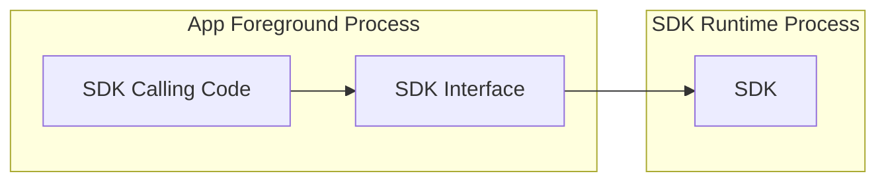
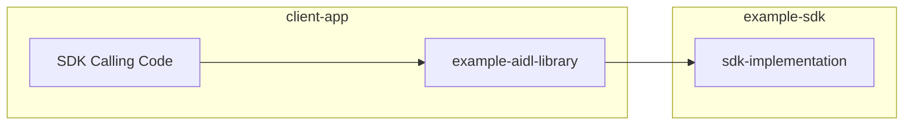

# Android SDK Runtime

SDK Runtime
=========

- `Design proposals`: Click [here](https://developer.android.com/design-for-safety/privacy-sandbox/sdk-runtime)
- `Developer Guides`: Click [here](https://developer.android.com/design-for-safety/privacy-sandbox/guides/sdk-runtime)

 

# Table of content   

- [Before you begin](#before-you-begin)
- [RE (Runtime-Enabled) SDKs](#re-sdks)

## <a id="before-you-begin"> Before you begin

- `Download Android Studio Hedgehog | 2023.1.1 Canary 2`: Click [here](https://developer.android.com/studio/preview)

- `Virtual Device`

    

    | Pixel 3 |
    | :--- |
    |  |

## <a id="re-sdks"> RE (Runtime-Enabled) SDKs

