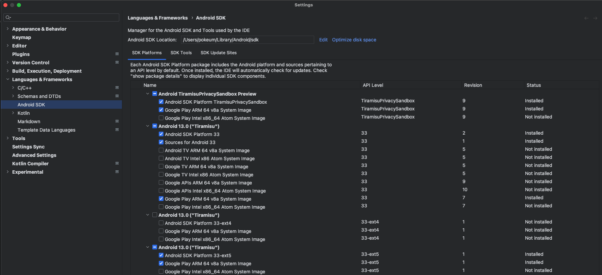
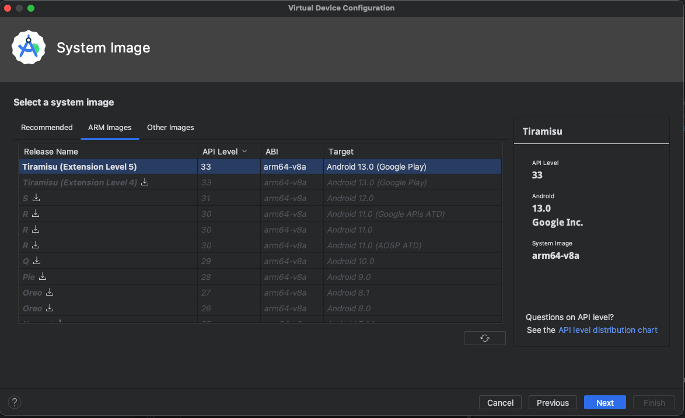

# Android SDK Runtime

SDK Runtime
=========

- `Design proposals`: Click [here](https://developer.android.com/design-for-safety/privacy-sandbox/sdk-runtime)
- `Developer Guides`: Click [here](https://developer.android.com/design-for-safety/privacy-sandbox/guides/sdk-runtime)

 

## Before you begin

- `Download Android Studio Hedgehog | 2023.1.1 Canary 2`: Click [here](https://developer.android.com/studio/preview)

- `Virtual Device`

    

    | Pixel 3 |
    | :--- |
    |  |
